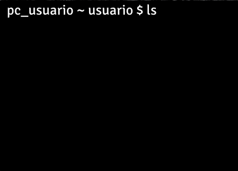
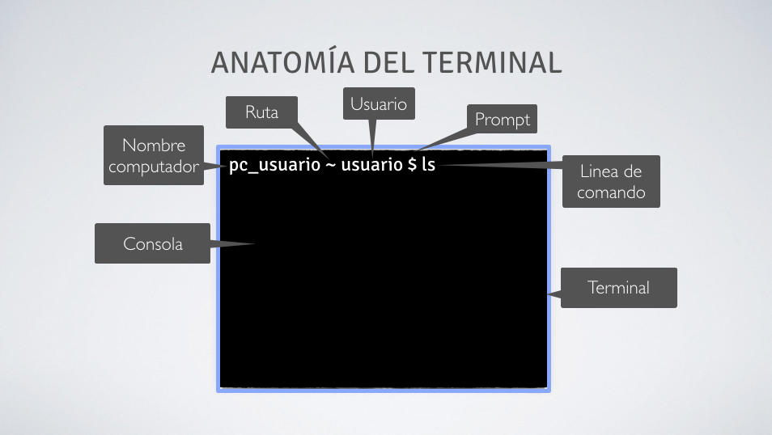

# 1.- Intro a terminal

## Pauta para el video:

1.	Bienvenida al curso.
2. Explicación de terminal
	-	¿Para qué sirve una terminal?
	-	usos típicos de la terminal.
	-	¿Cómo lo utilizo?
	- 	en qué lo ocupo (Unix)
- inicialización de terminal
- Primer acercamiento a la terminal mostrando sus partes.
- ejemplo primer comando en terminal (ls)
- Finalización del video.

## Guión Video:

### 1.	Bienvenida a la mini sección Terminal.

¡Hola!, en las siguiente cápsula de video conocerás la terminal, una poderosa herramienta que utilizarás a menudo, y que se transformará, sin lugar a dudas en tu mejor amiga y aliada en tu carrera como desarrollador.

### 2. ¿Qué es la terminal?

La terminal es una interfaz basada únicamente en texto que nos permite trabajar directamente con nuestro computador utilizando comandos.

Esto, en resumidas cuentas, es similar a usar el explorador de archivos y carpetas de tu sistema operativo. [Mostrar el explorador]

### ¿Por qué se llama terminal?
El nombre **terminal** viene de hace muchos años, se usaba para referirse a los dispositivos que serían para introducir datos o mostrar datos, hoy llamamos terminal al programa que utilizamos para ejecutar comandos directamente en nuestro computador. [Mostrar el terminal] 

### Motivación 
Entonces, ¿por qué usar la terminal?

Lo que marca la diferencia es lo potente que es, ya que con ella podemos administrar carpetas y archivos, realizar control de versiones de nuestro trabajo, ejecutar programas sin interfaz gráfica, automatizar tareas, entre otras características. Esto convierten a la terminal en una herramienta muy potente para el desarrollo.

### Diferencia de terminal entre sistemas operativos

Antes de avanzar es importante aclarar que la terminal de Windows no es exactamente igual a la de Linux o a la terminal de OSX

¿Y esto en que nos afecta?

A computadores con LINUX o MAC's en nada, pero los que tienen Windows si les afectará debido a que ese terminal se basa en otro sistema de líneas de comandos llamado CMD.

Esto tiene solución. Si tienes un computador con Windows, pausa el video y descarga desde el siguiente link la terminal.

[Agregar el link]

Los demás, sigamos.

### 3. Inicialización de terminal

Para inicializar el terminal utilizaremos un atajo:

En Linux: Presiona ctrl + alt + t
En Mac: Presiona ⌘ + espacio, busca por spotlight la terminal.
En Windows: busca el programa "git bash" y ábrelo.

Dentro nos encontraremos con la siguiente interfaz:

### 4. Primer acercamiento a la terminal mostrando sus partes.

Por lo general la terminal tiene la siguiente estructura:

- Terminal: (A.K.A consola) Es la interfaz donde damos instrucciones al computador.
- Prompt: Es el texto que muestra el terminal para indicar que el computador está listo para recibir un comando, usualmente termina con el caracter `$` 

Esta estructura es modificable y por lo tanto cuando veamos el computador de un desarrollador es muy probable que esté personalizada.

### 5. Ejemplo primer comando en terminal

Probemos esto.

Dentro de la terminal escribe el siguiente comando:

- `ls`

¿Qué sucedió?

El comando que usamos muestra todos los archivos que se encuentran en una ubicación en específico.

Existen muchos comandos interesantes y los iremos aprendiendo en los siguientes capítulos.

### 6. Finalización del video

¿Qué se sintió escribir tu primera línea de comandos en la terminal?

En el siguiente video conoceremos los comandos de navegación entre directorios.
Nos vemos en el siguiente video.

[Dejar como lectura adicional]
http://blog.desafiolatam.com/configurando-el-terminal-con-un-pro/
