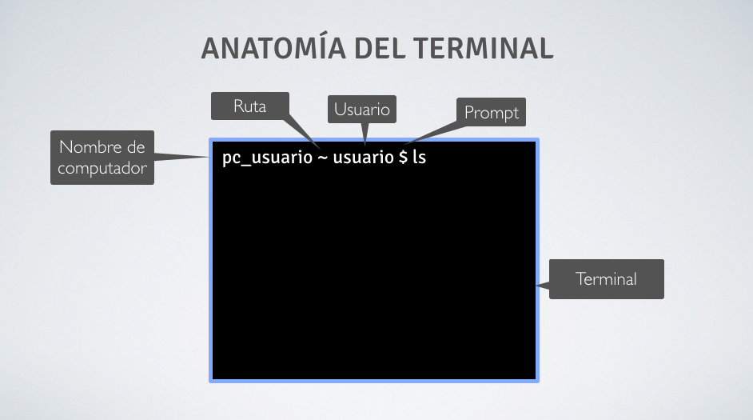

# 1.- Intro a terminal

## Pauta para el video:

1.	Bienvenida al curso.
2. Explicación de terminal
	-	¿Para qué sirve una terminal?
	-	usos típicos de la terminal.
	-	¿Cómo lo utilizo?
	- 	en qué lo ocupo (Unix)
- inicialización de terminal
- Primer acercamiento a la terminal mostrando sus partes.
- ejemplo primer comando en terminal (ls)
- Finalización del video.

## Guión Video:

### 1.	Bienvenida a la mini sección Terminal.

¡Hola!, en las siguientes cápsula de video conocerás la terminal, una poderosa herramienta que utilizarás a menudo, y que se transformará, sin lugar a dudas, en tu mejor amiga y aliada en tu carrera como desarrollador.

### 2. ¿Qué es la terminal

La terminal, es en si, una interfaz de texto en la que puedes navegar por archivos y carpetas de tu computador fácilmentes mediante lineas de comandos.

Esto, en resumidas cuentas, es similar a usar el explorador de archivos y carpetas de tu sistema operativo.

Entonces, por que usar la terminal? 

Lo que marca la diferencia es lo potente que es, ya que con ella podrás administrar carpetas y archivos, versionar tu trabajo, ejecutar programas sin interfaz gráfica, automatizar tareas, entre otras características, que convierten a la terminal en una herramienta inprescindible para el desarrollo.

Y Por supuesto, podrás presumir lo hacker que eres...

En fin, 

La terminal está basada en un sistema operativo muy antiguo llamado UNIX.

Sistemas operativos MacOS y LINUX están basado UNIX.

Y esto en que nos afecta?

A personas poseedoras de Computadores con LINUX o MAC's en nada, pero los que tienen windows si les afectará, debido a que este sistema operativo tiene otro sistema de lineas de comandos llamado CMD.

Si tienes un computador con windows, pausa el video y descarga desde el siguiente link la terminal.

Los demá, sigamos.

### 3. Inicialización de terminal

Para iniciar la terminal deberás:

En Linux: Presiona ctrl + alt + t
En Mac: Presiona ⌘ + espacio o busca por spotlight con el nombre terminal.
En Windows: busca el programa "git bash" y ábrelo.

Dentro nos encontraremos con la siguiente interfaz:

### 4. Primer acercamiento a la terminal mostrando sus partes.

Por lo general la terminal tiene la siguiente estructura:

- Consola: Es todo el sistema. Esto incluye la línea de comandos y los comandos escritos con anterioridad.
- Prompt: Comienza la línea de comando. Usualmente proporciona información contextual de donde estas.
- Linea de comando: Es la línea donde escribes un comando.
- Terminal: Es toda la interfaz de la consola.

Esta estructura, aunque se ve intimidante al principio, no lo es tanto.

### 5. Ejemplo primer comando en terminal

Probemos esto. 

Dentro de la terminal escribe el siguiente comando: 

- LS

¿Qué sucedió?

El comando que usamos muestra todos los archivos que se encuentran en una ubicación en específico.

### 6. Finalización del video

¿Qué se sintió escribir tu primera linea de comandos en la terminal?

En el siguiente video conoceremos los comandos de navegación entre directorios.

Nos vemos en el siguiente video.

	

