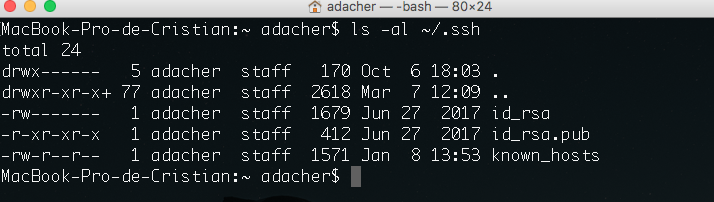
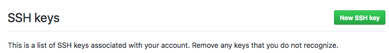

## Introducción a gestores de repositorios remotos

Hola, ya conocemos GIT, para que nos sirve y como utilizarlo de forma local, ahora conoceremos los gestores de repositorios remotos.

Uno de los fundamentos  de los sistemas de control de versiones es ayudarnos a trabajar en equipo, Para ello es que existen los gestores de repositorios remotos, los cuales serán simples repositorios de nuestro proyecto, pero alojadas en algún servicio de internet.

## ¿Cuales son los repositorios remotos mas usados?

Existen varios tipos de repositorios remotos y empresas asociadas a proporcionarlos, las más usadas son Github, Bitbucket y Gitlab. Todos funcionan de forma similar y lo importante es que soportan GIT, permitiéndonos de esta forma, gestionar con los mismos comandos desde nuestras máquinas, independiente del servicio que utilicemos.

Nosotros veremos y aprenderemos a  utilizar Github.

## Introducción a Github

Como mencionamos, Github es un gestor de repositorios remotos, lo que quiere decir que podemos almacenar una copia de nuestro código en sus servidores. Asi podemos trabajar colaborativamente  y respaldar nuestro trabajo. Github es gratis, y no tiene restricciones de cantidad de repositorios que podamos crear,  Lo que debemos tener en consideración que todo lo que creamos en github es público dándonos la  ventaja de compartir y recibir ayuda de cualquier parte del mundo.  Por supuesto si nuestro trabajo es privado, Github da la posibilidad de pagar una cuota mensual y contar con esta característica.

## Configuración Github

Vamos a crearnos una cuenta gratuita en Github,
Ingresa a su página [Github] (https://github.com/),  continua con el registro y si ya tienes cuenta ingresa a ella.

Desde la Github podremos crear nuevos repositorios o gestionar los que ya están creados.

Una parte importante de la configuración de github es añadir la clave ssh de nuestro equipo a la configuración de Github, lo que nos permitirá conectarnos de forma segura. 

Para lograr esta comunicación segura con los servicios de Github, necesitaremos contar con un par de llaves SSH, estas son las claves privada y publica de nuestros equipos, la primera no debemos compartirla con nadie y vive en nuestro equipo, la segunda podemos utilizarla y compartirla para ingresar a algún servicio que lo requiera.

Incluir nuestra clave publica ssh en el servidor para autentificarnos de forma segura, nos permitira no tener que autentificarnos cada vez que subamos un nuevo cambio.

 Imaginemos esto, como un sistema biometrico el cual tiene nuestros datos ingresados y solo necesitamos indicar que vamos acceder, si nuestro datos son erroneos no podremos acceder y nos pediran nuestras credenciales de acceso. 
 
 
 
## Obteniendo nuestra clave publica SSH

El primero paso para  configurar Github de forma segura es obtener la clave SSH, la forma de obtenerlo puede cambiar en cada sistema operativo y configuración, pero vamos a dar los pasos generales.

### Obteniendo Clave publica SSH

Mostraremos como se realiza en un sistema operativo MAC, los comandos no difieren mucho de otros sistemas operativos. 

Comencemos, abre una consola y sigue estas indicaciones.

1.	 Escribe el siguiente comando ``ls -al ~/.ssh``  esto buscará en tu sistema la carpeta .ssh  y mostrará los archivos disponibles, regularmente la clave pública está en un archivo con extensión .pub.  

Si no aparece nada, sigue con los pasos de generar una nueva clave.

Si tienes una clave generada veras algo como esto: 

2.	En este caso se llama id_rsa.pub abriremos este archivo con el siguiente comando. 
	
``pbcopy < ~/.ssh/id_rsa.pub``

Este comando copia todo el contenido del archivo y lo deja en el portapapeles, lo que debemos hacer ahora es 
pegarlo en Github.

### Ingresando clave publica ssh en github 

1.	Vamos a la pestaña de settings en Github.
2.  Seleccionaremos clave SSH y GPG 
3. Veremos un botón a la derecha que nos indica añadir una nueva clave pública.

 
 
4.  Si tenemos dudas, existe un [link](https://help.github.com/articles/connecting-to-github-with-ssh/) hacia la documentación con instrucciones para obtener la clave pública SSH de nuestro computador.

### Generar una nueva clave 

Si no se encuentra ningún archivo , quiere decir que no está generada la clave pública, así que la generamos con el siguiente comando :   
``ssh-keygen -t rsa -b 4096 -C "your_email@example.com"``

Por defecto se creará el archivo "id_rsa.pub" e "id_rsa"
El .pub es el público, y lo podemos enviar a otros, el id_rsa
debe quedar dentro de nuestro computador, alguien que tenga ese archivo puede falsear tu identidad.

Recuerda copiar la clave pública e ingresarlo en github, para probar que la clave funciona 

### Probando la clave SSH

Si ingresamos correctamente la clave en Github,  podemos utilizar ``ssh -T git@github.com``  lo que devolvera un mensaje:  "Hi tucorreo! You've successfully authenticated, but GitHub does not provide shell access".

Si no ocurre este, deberias repasar los pasos. Sin embargo, debemos recalcar que no es estrictamente necesario tener las llaves ssh en github ya que la página permite conectarnos por https, pero nos pedira autentificación cada vez que hagamos algun cambio o petición.

## fin de video

Con esta configuración ya podremos trabajar con nuestro primer gestor de repositorios remotos, En el siguiente video trabajaremos con Github.
